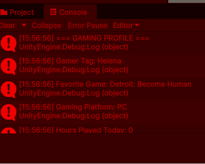
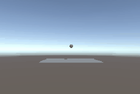
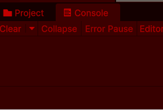
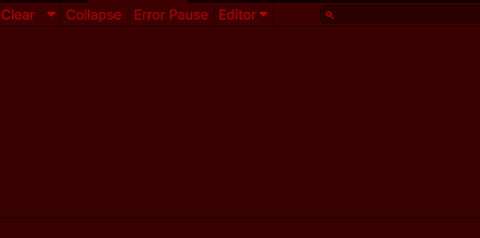
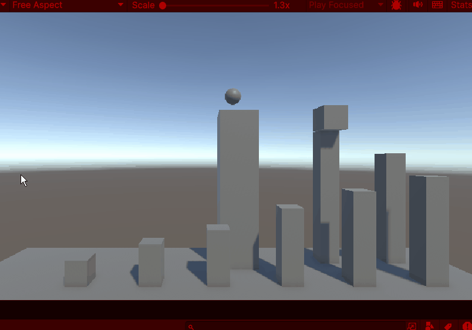

# github-les-5

## (Hier staan ook alle opdrachten voor gdv!)

.....................

## Opdracht 1.1: Primitive house.

### Hier hoort geen script bij.

.....................

## Opdracht 1.2: Gamer profile.

### [Gamer Profile script](PROG_opdrachten\Assets\scripts\GamerProfileDisplay.cs)

.....................

## Opdracht 2.1: Coin en Goomba.

### [Coin script](PROG_opdrachten\Assets\scripts\coin.cs)

### [Goomba script](PROG_opdrachten\Assets\scripts\heen_en_weer.cs)

.....................

## Opdracht 2.2: Virtual pet.

### [Virtual pet script](PROG_opdrachten\Assets\scripts\SimplePet.cs)

.....................

## Opdracht 3.1: Physics.

### Hier hoort geen script bij.

### Hier hoort geen script bij.
## 3.1B is niet realistisch omdat als je de gravity op 0 zet dan komt de bal niet meer naar beneden.

.....................

## Opdracht 3.2: Music player.

### [Music player script](PROG_opdrachten\Assets\scripts\MusicPlayer.cs)

.....................

## Opdracht 4.1: Coin collector.

### [Coin collector script](PROG_opdrachten\Assets\scripts\CoinPickup.cs)

.....................

## Opdracht 4.2:

### [Coin pickup script](PROG_opdrachten\Assets\scripts\CoinPickup.cs)
### Dit script en die van 4.1 zijn hetzelfde want de opdrachten werken in pricipe hetzelfde dus ik heb ze voor beide gebruikt.

.....................

## Opdracht 5.1: Health status en Weapon switch.

### [Health status script](PROG_opdrachten\Assets\scripts\HealthStatus.cs)

### [Weapon switch script](PROG_opdrachten\Assets\scripts\WeaponSwitch.cs)

.....................

## Opdracht 5.2: Interactieve deur met sleutel.

### [Player with key open door](PROG_opdrachten\Assets\scripts\PlayerWithKey.cs)

.....................

## Opdracht 6.1: Eigen mini-level.

### [Voor de coin](PROG_opdrachten\Assets\scripts\CoinVerdwijn.cs)
### [Voor de player](PROG_opdrachten\Assets\scripts\PlayerMove_Jump.cs)